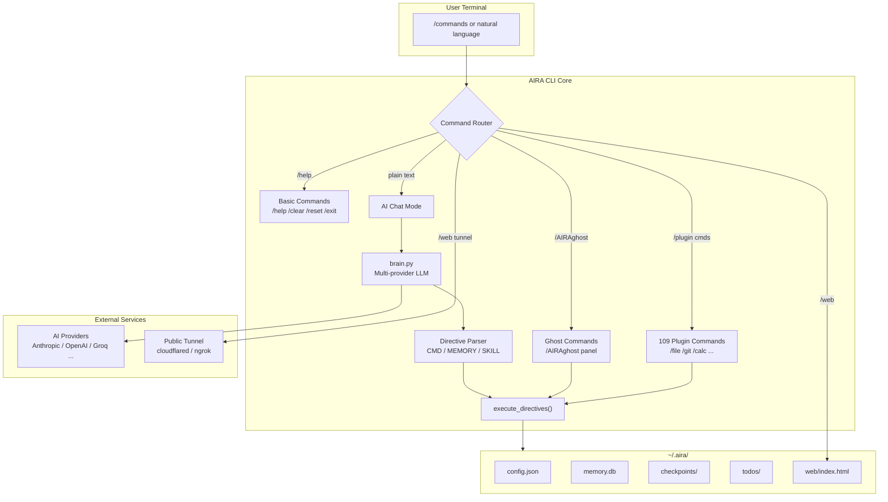
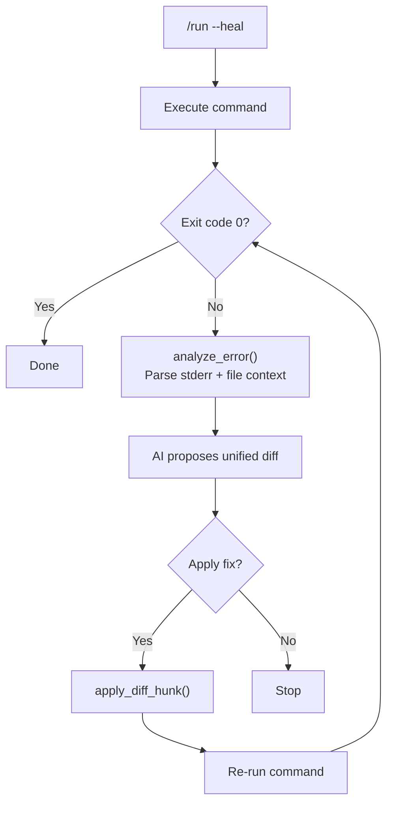

<p align="center">
  <pre>
     █████╗    ██╗   ██████╗     █████╗ 
    ██╔══██╗   ██║   ██╔══██╗   ██╔══██╗
    ███████║   ██║   ██████╔╝   ███████║
    ██╔══██║   ██║   ██╔══██╗   ██╔══██║
    ██║  ██║██╗██║██╗██║  ██║██╗██║  ██║
    ╚═╝  ╚═╝╚═╝╚═╝╚═╝╚═╝  ╚═╝╚═╝╚═╝  ╚═╝
  </pre>
</p>

<h1 align="center">A.I.R.A CLI</h1>

<p align="center">
  <strong>AIRA CLI</strong> — Autonomous Intelligence & Reasoning Agent Terminal
</p>

<p align="center">
  <a href="LICENSE"></a>
  
  
  
</p>

---

## What is AIRA CLI?

**AIRA CLI** (Repository: **A.I.R.A CLI**) is a next-generation AI-powered terminal agent for developers, builders, and power users. It combines a Rich-powered TUI, multi-provider LLM support, persistent memory, autonomous file operations, and 100+ utility plugins into one interactive shell.

Unlike a plain chat wrapper, AIRA CLI:

- **Executes** shell commands, patches files, and runs multi-step workflows
- **Remembers** context per project via a local knowledge graph
- **Heals** failed commands with AI-driven debugging (`/run --heal`)
- **Visualizes** memory and sessions in a live D3 graph (`/web`)
- **Undoes** agent actions with time-travel checkpoints (`/undo`)

All state lives locally under `~/.aira/` — your API keys, memories, todos, and checkpoints stay on your machine.

---

## Architecture Overview



---

## Session Flow

```mermaid
flowchart LR
    A[Launch `aira`] --> B{First run?}
    B -->|Yes| C[Setup Wizard\nProvider + API Key + Model]
    B -->|No| D[Load ~/.aira/config.json]
    C --> D
    D --> E[Interactive Prompt\nLive CPU/RAM/Disk overlay]
    E --> F{Input type?}
    F -->|/command| G[handle_command()]
    F -->|free text| H[AI Chat + Memory Search]
    H --> I[parse_ai_directives]
    I --> J[Execute tools / save memory]
    G --> E
    J --> E
    F -->|/exit| K[Session summary + save]
```

---

## Self-Healing Run Loop



---

## Installation

### Requirements

- Python **3.9+**
- An API key from any supported provider (Anthropic, OpenAI, Groq, Gemini, etc.)
- Optional: `git`, `gh`, `docker`, `cloudflared` / `ngrok` for extended features

### From source

```bash
git clone https://github.com/kvik0802/A.I.R.A-CLI.git
cd AIRA-CLI
pip install -r requirements.txt
pip install -e .
```

### Run

```bash
aira
```

On first launch, the setup wizard configures your provider, API key, model, and default project.

---

## Command System

AIRA CLI uses a **two-tier command model**:

| Tier | Panel | Count | How to view |
|------|-------|------:|-------------|
| **Basic** | Shown in `/help` | 4 | `/help` |
| **Ghost** | Hidden power commands | 61+ | `/AIRAghost` |
| **Plugins** | Utility shortcuts | 109 | `/plugin list` |

> **Tip:** Anything without a `/` prefix is sent to the AI as natural language chat.

---

## Basic Commands (4) — `/help`

| Command | Description |
|---------|-------------|
| `/help` | Show basic commands (points to `/AIRAghost` for the full list) |
| `/clear` | Clear the terminal screen |
| `/reset` | Reset the current AI conversation context |
| `/exit` | Exit AIRA (aliases: `/quit`, `/q`) |

---

## Ghost Commands (61+) — `/AIRAghost`

These commands are **not shown in `/help`**. Type `/AIRAghost` to open the gold ghost panel.

### Autonomous AI

| Command | Description |
|---------|-------------|
| `/forge <description>` | Autonomous project builder — AI creates files on Desktop |
| `/auto <task>` | Autonomous task mode — AI executes end-to-end without prompts |

### System

| Command | Description |
|---------|-------------|
| `/pulse` | Rich system pulse panel (CPU, RAM, disk, network) |
| `/sys` | System status snapshot |
| `/net` | Network info and public IP |
| `/weather` | Real-time weather for your location |
| `/doctor` | Run self-diagnostics and health checks |
| `/overlay` | Toggle live resource monitor panel |

### Memory

| Command | Description |
|---------|-------------|
| `/memory [query]` | List or search memories |
| `/remember <text>` | Save a memory |
| `/forget <memory_id>` | Delete a stored memory by ID |
| `/graph` | Knowledge graph search and link |

### AI Agents

| Command | Description |
|---------|-------------|
| `/subagent <task>` | Spawn an AI subagent |
| `/agent [name]` | List or spawn specialized agents |
| `/agent create <name> <desc>` | Create a custom agent |
| `/skills` | List evolved skills |
| `/skill <name>` | Show skill details |

### Files and Projects

| Command | Description |
|---------|-------------|
| `/scan [path]` | Scan directory tree with sizes and counts |
| `/build <type> <name>` | Generate project (33 template types) |
| `/explore [path]` | Show file tree (depth 2) |
| `/ls [path]` | List directory contents |
| `/read <file>` | Read file into AI context |
| `/copy <text>` | Copy text to clipboard |
| `/project <name>` | Switch active project |
| `/projects` | List all projects |
| `/history [pattern]` | Fuzzy search command history |
| `/snapshot` | Create or list directory snapshots |
| `/rollback <id>` | Restore from snapshot |
| `/undo` | Undo last agent action (files + conversation) |
| `/diff [file]` | Show colored git diff of current changes |
| `/patch <file> [diff]` | Interactive hunk-by-hunk patch apply |

### Session and Stats

| Command | Description |
|---------|-------------|
| `/sessions` | View recent sessions |
| `/schedule` | View scheduled tasks |
| `/cron add/del/log` | Cron task scheduler |
| `/recap` | Instant session recap (no LLM call) |
| `/usage` | Show token usage for this session |
| `/cost` | Show estimated cost for this session |
| `/todo [add\|done\|del\|clear]` | Task list manager (per project) |

### Configuration

| Command | Description |
|---------|-------------|
| `/config` | Show current configuration |
| `/api` | Change AI provider, API key, and model |

### Web and Services

| Command | Description |
|---------|-------------|
| `/search <query>` | Web search |
| `/web [port\|tunnel\|local\|stop]` | Memory graph visualizer (add `tunnel` for public URL) |
| `/serve [port\|tunnel\|local\|stop]` | Alias for `/web` |
| `/dashboard` | Start or stop local web dashboard |
| `/gateway` | Multi-platform bot gateway (Telegram / Discord / Slack / Signal) |

### Development

| Command | Description |
|---------|-------------|
| `/run <cmd>` | Execute a shell command |
| `/run --heal <cmd>` | Run command and auto-fix on failure |
| `/test` | Test runner (discover and execute pytest) |
| `/sandbox on\|off` | Toggle sandboxed execution (Docker / Daytona / Modal) |

### Cloud and DevOps

| Command | Description |
|---------|-------------|
| `/gh <args>` | GitHub CLI wrapper |
| `/github` | Alias for `/gh` |
| `/docker <args>` | Docker CLI wrapper with rich tables |
| `/cloud` | Cloud provider CLI wrappers (AWS / GCP / Azure) |
| `/aws`, `/gcp`, `/azure` | Cloud shortcuts (also: `/cloud aws ...`) |

### Security and Tools

| Command | Description |
|---------|-------------|
| `/vault` | Encrypted credential store |
| `/genpass [length]` | Generate password and copy to clipboard |

### Advanced Features

| Command | Description |
|---------|-------------|
| `/vision [prompt]` | Analyze image with AI vision |
| `/template` | Template marketplace (list / install) |
| `/doc generate` | Auto-generate docs from source AST |
| `/mcp` | MCP server management |
| `/miro` | Project kanban board (todo / doing / done) |
| `/plugin list\|search\|info` | Browse and inspect the plugin system |

### Aliases

| Command | Description |
|---------|-------------|
| `/quit`, `/q` | Exit aliases (same as `/exit`) |

---

## Plugin Commands (109)

Beyond ghost commands, AIRA ships **109 utility plugins** across 12 categories:

| Category | Examples |
|----------|----------|
| **Files** | `/tree`, `/grep`, `/head`, `/tail`, `/zip` |
| **System** | `/top`, `/kill`, `/disk`, `/uptime` |
| **Network** | `/ping`, `/dns`, `/http`, `/download` |
| **Dev** | `/git`, `/gitlog`, `/npm`, `/pip` |
| **Data** | `/csv`, `/yaml`, `/xml`, `/uuid` |
| **Math** | `/eval`, `/exec`, `/random`, `/units` |
| **Fun** | `/joke`, `/cowsay`, `/fortune`, `/ascii` |
| **Windows** | `/open`, `/edit`, `/explorer`, `/weather` |

Browse all plugins:

```bash
/plugin list
/plugin search docker
/plugin info ping
```

---

## Key Features in Detail

### Interactive Patch Editor

```bash
/diff                    # Git diff or checkpoint diff
/patch file.py fix.diff  # Review each hunk: y / n / q / e
```

Parses unified diffs, shows colored hunks, and applies changes line-by-line with undo support.

### Self-Healing Commands

```bash
/run --heal python app.py
```

On failure, AIRA analyzes stderr, reads affected source files, asks the AI for a minimal fix, shows a diff, and retries automatically.

### Time-Travel Undo

Checkpoints are saved before AI actions, `/run`, and `/patch`. Restore with:

```bash
/undo
```

Reverts modified files and rolls back conversation context.

### Memory Graph Visualizer

```bash
/web                     # LAN access at http://YOUR_IP:8000
/web tunnel              # Public URL via cloudflared / ngrok / localtunnel
/web stop                # Stop server and tunnel
```

Dark-themed D3.js dashboard showing memories, sessions, projects, and knowledge-graph links.

### Live Resource Overlay

The prompt bar shows real-time stats:

```
[CPU:12% | RAM:45% | Disk:540GB free] ~/project [AIRA] ◈
```

Use `/overlay` for a full-screen live monitor.

### Per-Project Todos

```bash
/todo add Fix login bug
/todo done 3
/todo list
```

Stored at `~/.aira/todos/<project>.json`.

---

## Supported AI Providers

| Provider | Config key |
|----------|------------|
| Anthropic | `anthropic` |
| OpenAI | `openai` |
| OpenRouter | `openrouter` |
| Google Gemini | `gemini` |
| Groq | `groq` |
| DeepSeek | `deepseek` |
| Mistral | `mistral` |
| Cohere | `cohere` |

Change anytime with `/api` or edit `~/.aira/config.json`.

---

## Project Structure

```
AIRA-CLI/
├── aira/
│   ├── main.py          # CLI loop, command routing, ghost commands
│   ├── brain.py         # Multi-provider AI + directive parsing
│   ├── memory.py        # SQLite memory, skills, sessions, graph
│   ├── tools.py         # Shell, diff, checkpoints, tunnels, todos
│   ├── ui.py            # Rich TUI, themes, help panels
│   ├── plugins.py       # 109 utility plugins
│   ├── gateway.py       # Telegram / Discord / Slack bots
│   ├── mcp_tools.py     # Model Context Protocol servers
│   ├── dashboard.py     # Web dashboard
│   └── skills/          # Bundled agent skills
├── assets/
│   └── aira-logo.png    # Project symbol
├── tests/               # Unit tests
├── requirements.txt
├── setup.py
├── LICENSE              # Apache 2.0
└── README.md
```

---

## Configuration

All local data is stored in `~/.aira/`:

| Path | Purpose |
|------|---------|
| `config.json` | Provider, API key, model, theme |
| `memory.db` | Memories, skills, sessions, knowledge graph |
| `checkpoints/` | Undo snapshots |
| `todos/` | Per-project task lists |
| `web/index.html` | Graph visualizer dashboard |
| `history.txt` | Command history |

**Never commit `.aira/` or API keys to git.** A `.gitignore` is included.

---

## Development

```bash
# Run tests
python -m unittest discover -s tests -p "test_*.py" -v

# Syntax check
python -m py_compile aira/main.py aira/tools.py aira/ui.py
```

---

## Publishing to GitHub

Repository name recommendation: **`AIRA-CLI`** (display name: **A.I.R.A CLI**)

```bash
cd AIRA-CLI
git init
git add .
git commit -m "Initial release: AIRA CLI v1.0.0"
git branch -M main
git remote add origin https://github.com/kvik0802/A.I.R.A-CLI.git
git push -u origin main
```

Replace `YOUR_USERNAME` in `setup.py` and this README before pushing.

---

## License

**Apache License 2.0** — see [LICENSE](LICENSE).

Apache 2.0 provides:

- Permissive use, modification, and distribution
- **Explicit patent grant** from contributors
- Liability and warranty disclaimers

Copyright **2026 NSS Enterprises / Vicky**.

---

## Author

**NSS Enterprises / Vicky**

Built with Python, Rich, prompt_toolkit, and multi-provider AI APIs.

<p align="center">
  
  <br>
  <strong>A.I.R.A CLI</strong> — Think. Build. Execute.
</p>
